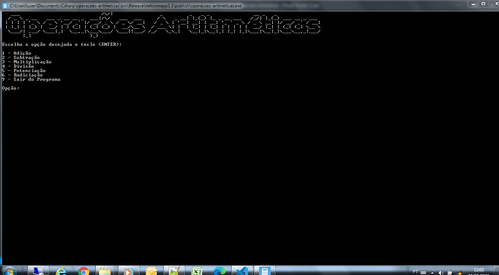

# Sistema de Operações Aritméticas

## _Propósito_

Esse pequeno programa console realiza operações aritméticas basicas de:

* Adição
* Subtração
* Multiplicação
* Divisão
* Potenciação
* Radiciação

## _Screenshot_



## _Download_

Dê um duplo clique no arquivo abaixo e descompacte na pasta desejada.

[🤐  Download do arquivo .ZIP](dist/operacoes-aritmeticas.zip)


## Linha de Comando para excecução

Se estiver utilizando o Sistema Operacional Windows, dê um duplo-clique no arquivo **operacoes-aritmeticas.exe**, caso contrário, execute a linha de comando abaixo:

```
dotnet operacoes-aritmeticas.dll
```

## Agradecimentos

- [Figgle](https://github.com/drewnoakes/figgle)
- [Prof. Ermogenes Palacio](https://github.com/ermogenes)
- [Dev C#](https://github.com/ermogenes/aulas-programacao-csharp)

---
Copyright (C) [Fábio Luiz Dias](https://github.com/fabio.faludi). Todos os direitos reservados.
